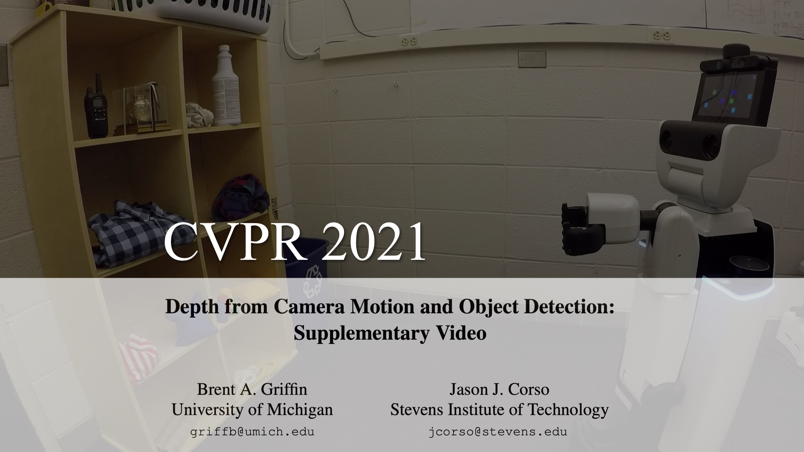

# ODMD Dataset
ODMD is the first dataset for learning **O**bject **D**epth via **M**otion and **D**etection. ODMD training data are configurable and extensible, with each training example consisting of a series of object detection bounding boxes, camera movement distances, and ground truth object depth. As a benchmark evaluation, we provide four ODMD validation and test sets with 21,600 examples in multiple domains, and we also convert 15,650 examples from the [ODMS benchmark](https://github.com/griffbr/odms "ODMS dataset website") for detection. In our paper, we use a single ODMD-trained network with object detection *or* segmentation to achieve state-of-the-art results on existing driving and robotics benchmarks and estimate object depth from a camera phone, demonstrating how ODMD is a viable tool for monocular depth estimation in a variety of mobile applications.

Contact: Brent Griffin (griffb at umich dot edu)

__Depth results using a camera phone.__


## Using ODMD

__Run__ ``./demo/demo_datagen.py`` to generate random ODMD data to train or test your model. <br />
Example data generation and camera configurations are provided in the ``./config/`` folder. 
``demo_datagen.py`` has the option to save data into a static dataset for repeated use. <br />
[native Python]

__Run__ ``./demo/demo_dataset_eval.py`` to evaluate your model on the ODMD validation and test sets. <br />
``demo_dataset_eval.py`` has an example evaluation for the Box<sub>LS</sub> baseline and instructions for using our detection-based version of [ODMS](https://github.com/griffbr/ODMS "ODMS dataset website"). 
Results are saved in the ``./results/`` folder. <br />
[native Python]

## Benchmark

| Method | Normal | Perturb Camera | Perturb Detect | Robot | All |
| --------------- | --------------- | --------------- | --------------- | --------------- | --------------- |
| [DBox](https://arxiv.org/abs/2103.01468 "CVPR 2021 Paper") | 1.73 | 2.45 | 2.54 | **11.17** | **4.47** |
| [DBox<sub>Abs</sub>](https://arxiv.org/abs/2103.01468 "CVPR 2021 Paper") | 1.11 | **2.05** | **1.75** | 13.29 | 4.55 |
| [Box<sub>LS</sub>](https://arxiv.org/abs/2103.01468 "CVPR 2021 Paper") | **0.00** | 4.47 | 21.60 | 21.23 | 11.83 |

Is your technique missing although it's published and the code is public? Let us know and we'll add it.

## Using DBox Method

__Run__ ``./demo/demo_dataset_DBox_train.py`` to train your own DBox model using ODMD. <br />
__Run__ ``./demo/demo_dataset_DBox_eval.py`` after training to evaluate your DBox model. <br />
Example training and DBox model configurations are provided in the ``./config/`` folder.
Models are saved in the ``./results/model/`` folder. 
``demo_dataset_DBox_eval.py`` also has instructions to use our pretrained DBox model from our paper. <br />
[native Python, has Torch dependency]

## Publication
Please cite our [paper](https://arxiv.org/abs/2103.01468 "Depth from Camera Motion and Object Detection pdf") if you find it useful for your research.
```
@inproceedings{GrCoCVPR21,
  author = {Griffin, Brent A. and Corso, Jason J.},
  booktitle={The IEEE Conference on Computer Vision and Pattern Recognition (CVPR)},
  title = {Depth from Camera Motion and Object Detection},
  year = {2021}
}
```

__CVPR 2021 supplementary video:__ https://youtu.be/GruhbdJ2l7k

[](https://youtu.be/GruhbdJ2l7k)

## Use

This code is available for non-commercial research purposes only.